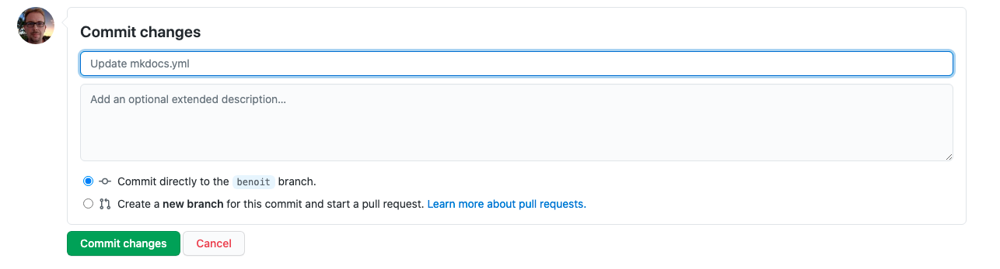

# Comment contribuer 

Pour que les modifications se passent bien, chacun va travailler sur une version temporaire du site web.
Il fera ses modifications et m'indiquera quand tout sera fini de son côté.
De mon côté (Anthony), je ferai une vérification et intègrerai les modifications au site. 

## Pour commencer

1. Se connecter avec son compte

## Apprendre rapidement comment écrire en __markdown__

1. Le lien officiel en __Anglais__ de [Github](https://github.com/adam-p/markdown-here/wiki/Markdown-Cheatsheet)
2. Un site en français de [Christophe du Camp](https://www.christopheducamp.com/2014/09/18/love-markdown)

## Modifier un article depuis "github.com"

1. Sélectionner une `branche` (ici `benoit`)

2. Naviguer jusqu'au repertoire ou se trouve le fichier

3. Cliquer sur le fichier à modifier

4. Cliquer sur `Edit the file' (modifier le fichier)

5. Modifier votre fichier

6. Visualiser vos modifications 

7. Confirmer vos modifications

 
## Créer un article depuis "github.com"

1. Selectionner une `branche` (ici `benoit`)

2. Ouvrir le fichier de configuration `mkdocs.yml`   

 
3. Modifier le fichier en cliquant sur `Edit this file` (modifier ce fichier)
 

4. Effectuer les modifications :
  

    Pour ajouter une page, il faut créer les champs suivants :
    - arborescence
    - titre
    - chemin vers le fichier

5. Ajouter un message pour indiquer vos modifications (optionnel)

6. Confirmer cos modification en cliquant sur `commit`

7. Naviguer jusqu'au répertoire ou se trouve le fichier

8. Créer un nouveau fichier en lui donnant le nom précédemment référencé dans le fichier `mkdocs.yaml

8. Faire vos modifications dans le fichier en suivant le formalisme `markdown` 

9. Visualiser vos modifications 

10. Confirmer vos modifications

