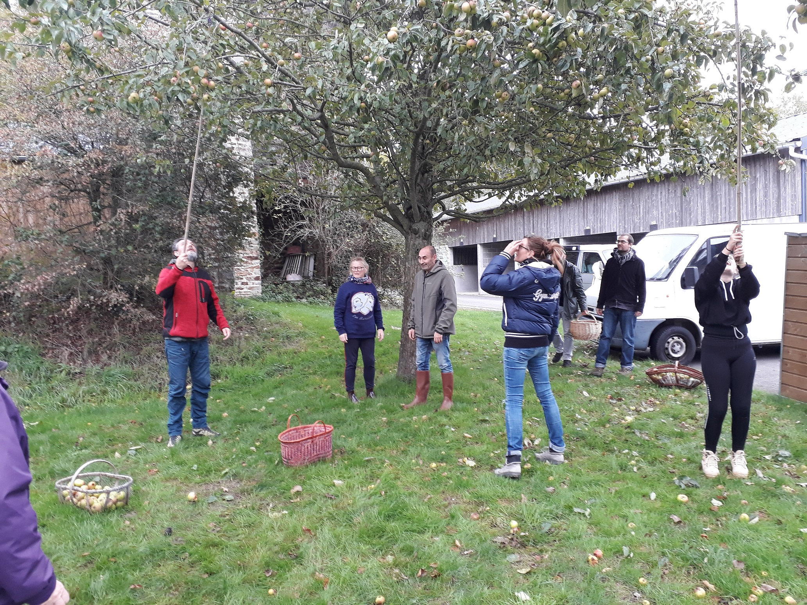
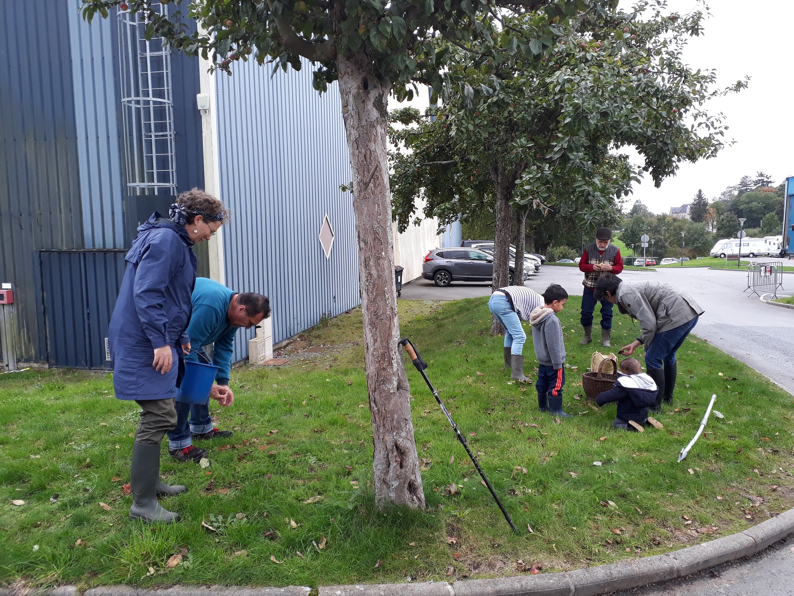

# Bravo à l'association et à tous ces membres.

Voici quelques moments forts de la journée illustre de quelques photos.

## Cueillette

On commence par cueillir ou secouer les pommiers avec des gaules :

## Ramasse

Puis on les ramasse tous ensemble avec l'aide des petits

## Emballage

Enfin on les met en sac en toile.

## Victoire

Une première victoire contre le gaspi, mais aussi une belle récompense à venir, car les pommes seront presses par Mouvipress ce mercredi 23 octobre 2019, au parc expo vers 10h30.

N'hésitez pas à passer vous serez les bienvenues.

Nous vous invitons également à venir déguster le jus de cette cueillette, dans l'après-midi (il sera encore trop chaud le matin).