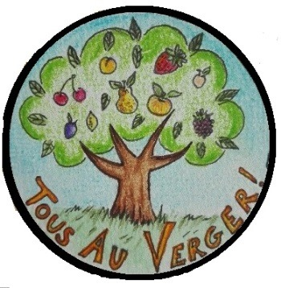

# Tous au verger

## Notre action

Valorise les arbres fruitiers délaissés !

{: .center width="300px" height="300px"}

## Que fait "Tous au Verger" ?

Au sein de notre association :

- Nous préservons le patrimoine végétal et local
- Nous mettons en place des évènements pour la collecte
- Nous effectuons la taille des fruitiers
- Nous effectuons la greffe des fruitiers
- Nous effectuons la transformation des fruits
- Nous effectuons la vente de produits issus des fruits récoltés
- Nous sensibilisons à l'environnent et au gaspillage
- Nous travaillons avec les établissements d'insertion

## Où sommes-nous ?

Dans le pays de Vitré, mais nous sommes ouvert aux collaborations avec d'autres villages, pays.

## Qui sommes-nous ?

Une bande de bénévoles qui aiment notre patrimoine végétal et détestent le gaspi ! 

## Événements à venir :

[cards cols=1 image-bg(./docs/cards.yaml)]